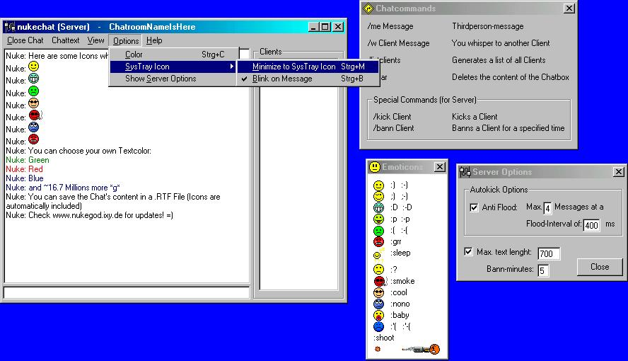



## Complete Chat using Winsock\.

### Description

It's a really good Chat programm for both using in LAN and Internet. The Programm looks automatically for Chatrooms in your whole LAN, so you don't have to insert any IPs. Just click on "Get Internet Chatrooms" and you will receive a list of all open chatrooms in the entire internet. ":) ;)" and over 45 other Smileys will be automatically turned into little grafics. As a Chatroom Server, you can Kick or Bann other Users for a specified time if necessary. Of course all the chatters can have their own Textcolor they want(chosen from the windows-color palette). And the chat has got a nice feature: You can minimize the Chat into a SysTray-Icon (e.g. when the Manager walks into your Office :). You can choose if the Icon starts to blink when a message arrives. I also added a "Doskey" feature, so you can access all you typed messages with the Up- Down- Keys. There still are some other little features, which I don't want to list here, because it would take too much place :)

Check out www.nukegod.ixy.de for the last versions
 
### More Info
 
The comments are written in german :( because I'm from Switzerland

but if you have any questions about the Code, feel free to ask: nyook@gmx.net

             |
---                |---
**Submitted On**   |2001-11-18 16:30:48
**By**             |[nyook](https://github.com/Planet-Source-Code/PSCIndex/blob/master/ByAuthor/nyook.md)
**Level**          |Intermediate
**User Rating**    |4.6 (64 globes from 14 users)
**Compatibility**  |VB 5\.0, VB 6\.0
**Category**       |[Complete Applications](https://github.com/Planet-Source-Code/PSCIndex/blob/master/ByCategory/complete-applications__1-27.md)
**World**          |[Visual Basic](https://github.com/Planet-Source-Code/PSCIndex/blob/master/ByWorld/visual-basic.md)
**Archive File**   |[Complete\_C1405661042002\.zip](https://github.com/Planet-Source-Code/nyook-complete-chat-using-winsock__1-22870/archive/master.zip)

